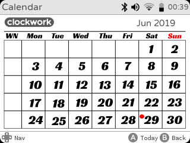

# cpiCalendar
The simple Calendar App for ClockWorkPI GameSH

# Running
1- On your GameSH copy cpiCalbg5.png and calnum.png to ~/launcher/skin/default/sys.py/gameshell/icons

2- On your GameSH copy calendar.png to ~/launcher/skin/default/Menu/GameShell

3- On your GameSH copy 95_calendar to ~/launcher/Menu/GameShell/

4- Reboot or Reload your GameSH

Up Next Year
Down Previous Year
Left Previous Month
Right Next Month

# Built with
